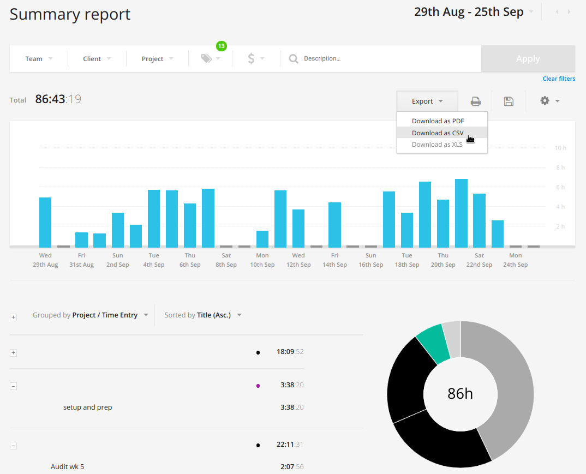
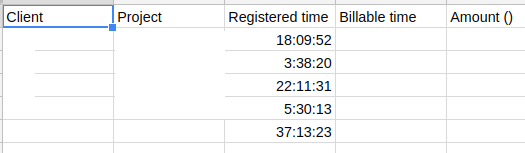
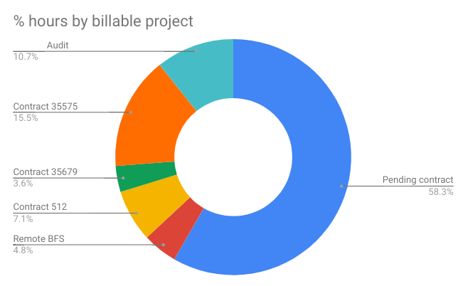

[](https://travis-ci.com/ggodreau/toggl)

# Toggl API Raw Data Export
---

### The problem:

- The free tier toggl reports look as follows:
<p align="center">

</p>

- This is fine and dandy, but the _task level_ items don't get exported when you click on export -> csv. Instead, they're grouped by and contain none of the detail:

<p align="center">

</p>

- We need a way to get the task-level information! Fo' free!

<p align="center">

</p>

### The solution:

- It looks like the [toggl API](https://github.com/toggl/toggl_api_docs/blob/master/chapters/time_entries.md) has a small loophole in the `/time_entries` endpoint which allows you to get task-level info from an API response.
- This script calls this API, using your [API token](https://toggl.com/app/profile) (see the bottom of the page), returning all the task information (and more!) between two user-specified dates.
- The file type returned is a simple `.csv`, which can be easily uploaded into excel, python, or other utility. Here's an example of the chart you can make with the output which fits a common use case of 'total time between two dates, grouped by tag' - something you _can't_ do without paying for a subscription via the UI:

<p align="center">

</p>

### Dependencies:

- python3 (tested on 3.6.6)
- pandas
- requests
- json

### How to use:

- Clone this repository to your machine
- Enter directory
- Format of command is:

```python get_tasks.py <api_key> <start_date> <end_date>```

- Here's an example with a fake API key.

```python get_tasks.py 894e66455860a4ea3fde5dd0cf35f566 2018-08-29T15:42:46+02:00 2018-09-24T15:42:46+02:00```

- Note that the timezone is the +02:00 you see in the above example.
- Also note that a maximum of 1,000 entries can be returned per the [toggl API docs](https://github.com/toggl/toggl_api_docs/blob/master/chapters/time_entries.md).
- The script will prompt you for a location to place the output file. If you hit enter, it will place it in `./out.csv`.
